# Meal Photo Upload & AI Calorie Estimation with Context-Aware AI Coach

**Goal:** Implement meal photo upload, multimodal AI vision analysis to estimate portions and calculate exact calories/macros using `@nutrio/food-db`, remove the unused mic tab, and implement a live context-aware AI Coach conversation in the Coach tab.

**Architecture:**
- **AI Service Layer (`apps/mobile/src/ai/`)**: Unified client supporting OpenAI (`gpt-4o-mini`) and Google Gemini (`gemini-1.5-flash`) for Vision & Chat, with deterministic South Asian culinary fallback when no key is set. Secure key storage via environment variables and an in-app settings modal.
- **Multimodal Meal Logger (`UnifiedLogMealModal.tsx`)**: Refactored to a streamlined 2-tab interface:
  1. `[🔍 Search / Manual]`
  2. `[📸 AI Photo Scan]` with real HTML5 file upload/camera capture, live image preview, context note, and "⚡ Analyze Meal with AI" trigger.
  - Passes detected dishes and masses to `resolveDetectedPlate()` (`@nutrio/nutrition-core`) to calculate exact non-hallucinated calories, protein, carbs, fat, and cooking oil grams, opening `MealPlateReviewModal` for 1-tap logging.
- **Context-Aware AI Coach (`CoachChatScreen.tsx`)**: Connects live to `aiService.sendCoachMessage()`. Injects current user metrics (consumed vs target calories, remaining calorie budget, consumed macros, and Pakistani health levers like oil in handis and doodh patti chai). Shows live typing indicator and interactive suggested chips.

```mermaid
graph TD
    subgraph "Meal Photo AI Ingestion"
        A[User Uploads Meal Photo] --> B[Preview & Optional Context]
        B --> C[aiService.analyzeMealPhoto]
        C --> D{API Key Configured?}
        D -->|Yes: OpenAI/Gemini| E[AI Vision Detection: Dishes & Grams]
        D -->|No: Local Engine| F[Deterministic Desi Staples Fallback]
        E --> G[resolveDetectedPlate & @nutrio/food-db]
        F --> G
        G --> H[MealPlateReviewModal: Exact Calories & Macros]
        H --> I[1-Tap Log to Breakfast/Lunch/Dinner]
    end

    subgraph "Context-Aware AI Coach"
        J[Open Coach Tab] --> K[Compile Live CoachContext]
        K --> L[aiService.sendCoachMessage]
        L --> M[Streaming / Generated Response + Suggested Chips]
        M --> N[CoachChatScreen Conversation History]
    end
```



**Tech Stack:** React Native Web, Expo, TypeScript, `@nutrio/food-db`, `@nutrio/nutrition-core`, OpenAI API / Google Gemini API.  
**Spec:** [`2026-09-04-photo-ai-calorie-coach-design.md`](file:///e:/Nutrio/docs/superpowers/specs/2026-09-04-photo-ai-calorie-coach-design.md)

---

## Global Constraints
- Preserve all existing nutrition calculations, BMR/TDEE math, and test coverage (134 tests must remain passing).
- Zero hallucination of nutritional numbers: AI identifies dish names and estimated portion grams; all calorie and macro math is calculated deterministically via `@nutrio/food-db`.
- UI must strictly follow the modern Light Emerald Theme (`#F6F8F6` canvas, `#FFFFFF` cards, `#10B981` primary emerald, `#1E293B` text).
- Web Speech / mic option is cleanly removed from the UI as requested.

---

## Proposed Tasks

### Task 1: AI Service Layer & Secure Key Storage (`apps/mobile/src/ai/`)
**Files:**
- Create: `apps/mobile/src/ai/types.ts`
- Create: `apps/mobile/src/ai/apiKeyStorage.ts`
- Create: `apps/mobile/src/ai/ai-service.ts`
- Test: `apps/mobile/src/ai/__tests__/ai-service.test.ts`

**Responsibilities:**
- `types.ts`: Define `VisionDishDetection`, `PhotoAnalysisResult`, `CoachChatMessage`, `AiProviderConfig`.
- `apiKeyStorage.ts`: Read `EXPO_PUBLIC_OPENAI_API_KEY` / `EXPO_PUBLIC_GEMINI_API_KEY` or `localStorage` key.
- `ai-service.ts`:
  - `analyzeMealPhoto(imageBase64, contextNote)`: Calls OpenAI or Gemini with specialized South Asian vision prompt. If no key, utilizes domain fallback (`Chicken Karahi & Whole Wheat Roti`, `Chicken Biryani`, etc.).
  - `sendCoachMessage(messages, context)`: Builds coach prompt with live user context and calls chat completion API. Extracts reply text and 3 follow-up suggestions (`SUGGESTIONS: [...]`).
- Unit tests validating fallback, OpenAI/Gemini formatting, and error handling.

---

### Task 2: Meal Photo Upload & Calorie Estimation in `UnifiedLogMealModal.tsx`
**Files:**
- Modify: `apps/mobile/src/tracker/ui/UnifiedLogMealModal.tsx`
- Test: `apps/mobile/src/tracker/__tests__/unified-log.test.ts`

**Responsibilities:**
- Remove the unused Voice/Mic tab and simplify tabs to `[🔍 Search]` and `[📸 AI Photo Scan]`.
- Implement real file picker / camera trigger:
  - Hidden `<input type="file" accept="image/*" />` for Web / Expo.
  - Read uploaded file as base64 data URL.
  - Display photo preview card with thumbnail image, image size, and "Change Photo" button.
  - Optional meal context note input (e.g. *"home-cooked daal with whole wheat roti"*).
- Connect **"Analyze Meal with AI"** button:
  - Calls `aiService.analyzeMealPhoto()`.
  - Passes detected items to `resolveDetectedPlate()` (`@nutrio/nutrition-core`) against `PAKISTANI_STAPLES_DATA`.
  - Opens `MealPlateReviewModal` with verified calories, protein, carbs, fat, and oil.
  - Confirming items logs them into the chosen meal slot (`breakfast`, `lunch`, `dinner`, `snacks_chai`).

---

### Task 3: Context-Aware Live AI Coach Conversation in `CoachChatScreen.tsx`
**Files:**
- Modify: `apps/mobile/src/coach/ui/CoachChatScreen.tsx`
- Modify: `apps/mobile/src/tracker/ui/TrackerDashboardScreen.tsx` (ensure live targets and summary are passed to Coach)
- Test: `apps/mobile/src/coach/__tests__/coach-chat-screen.test.ts`

**Responsibilities:**
- Update `CoachChatScreen`:
  - Inject live `CoachContext` (remaining calories, target macros, consumed calories, and Pakistani cultural habits).
  - Replace static `setTimeout` responses with live `aiService.sendCoachMessage()`.
  - Add typing indicator while waiting for AI generation.
  - Dynamically render updated interactive suggested chips based on AI reply.
  - Add an "⚙️ AI Settings" badge in the header allowing users to view or input their OpenAI or Gemini API key.

---

### Task 4: Verification, Full Monorepo Tests & Visual Review
**Files:**
- Run: `npm test` across all workspaces (`@nutrio/food-db`, `@nutrio/nutrition-core`, `@nutrio/mobile`, Supabase functions).
- Test photo meal logging end-to-end.
- Test coach conversation and suggestion chips end-to-end.
- Update `walkthrough.md`.

---

## Verification Plan

### Automated Tests
```bash
# Run unit tests for AI service and updated components
npm test --workspace=@nutrio/mobile

# Run full monorepo suite to ensure zero regressions
npm test
```

### Manual Verification
1. Navigate to **http://localhost:8081**.
2. On the **Today Meals** section, tap `+ Add Food` on **Lunch**.
3. Select **📸 AI Photo Scan**. Confirm the Mic tab is gone.
4. Click **"Upload Meal Photo"**, select any food image, and verify the image thumbnail preview renders.
5. Tap **"Analyze Meal with AI"**: Verify the AI vision model (or intelligent fallback) identifies the dishes, calculates calories/macros with `@nutrio/food-db`, and opens the review plate card.
6. Tap **"Log Meal"**: Verify the items appear in Lunch and progress circles update.
7. Open the **🧑‍⚕️ Coach** tab: Type a message (e.g., *"How can I cut oil in dinner tonight?"*). Verify the AI replies with context-specific advice and updates the suggested topic chips.
