# Nutrio Solid Lime Minimalist End-to-End Redesign Implementation Plan (Dark/Light Mode & 100% Free)

> **For agentic workers:** REQUIRED SUB-SKILL: Use superpowers:subagent-driven-development to implement this plan task-by-task. Steps use checkbox (`- [ ]`) syntax for tracking.

**Goal:** Transform the Nutrio mobile application into an ultra-modern, distinctive experience using a **Solid Electric Lime** aesthetic with refined Swiss typography, full **Dark Mode & Light Mode support** in user settings, and **100% free functionality with all paywalls, payment methods, and tier restrictions permanently removed**.

**Architecture:** We establish a dynamic theme provider in `apps/mobile/src/theme.ts` supporting both `darkColors` (canvas `#0C0D10`, cards `#18191E`) and `lightColors` (canvas `#F6F7FB`, cards `#FFFFFF`), featuring a punchy solid lime hero card (`#D4FF00` with `#0A0B0D` high-contrast pitch-black text). We purge all paywalls and payment gates from `UnifiedLogMealModal.tsx` and the codebase. We then overhaul each screen (Home, Survey, Plan Telemetry, Dashboard with 2x2 metric tiles, Dish Customizer, Food Search, Weight Tracker, and AI Coach) with the new theme and test for seamless dark/light switching.

**Architecture Diagram:**

```mermaid
graph TD
    subgraph "Theme Engine (theme.ts)"
        ThemeContext["ThemeContext / useTheme()"]
        DarkMode["Dark Theme (Obsidian #0C0D10 + Charcoal #18191E)"]
        LightMode["Light Theme (Alabaster #F6F7FB + White #FFFFFF)"]
        LimeAccent["Solid Lime Accent (#D4FF00)"]
        ThemeContext --> DarkMode
        ThemeContext --> LightMode
        ThemeContext --> LimeAccent
    end

    subgraph "User Setting"
        Toggle["Dark / Light Mode Switcher"] --> ThemeContext
    end

    subgraph "App Screens (100% Free - Zero Paywalls)"
        Home["1. HomeScreen (Welcome + Theme Toggle)"]
        Survey["2. OnboardingSurveyScreen (Biometrics)"]
        Plan["3. PlanWorkflowScreen (Telemetry Calculation Reveal)"]
        Dashboard["4. TrackerDashboardScreen (Solid Lime Hero + 2x2 Grid)"]
        Search["5. UnifiedLogMealModal (60+ Brands, 100% Free)"]
        Customizer["6. ItemCustomizerModal (Portion & Fat Controls)"]
        Weight["7. WeightTrackerScreen (EMA Trend Graph)"]
        Coach["8. CoachChatScreen (Unlimited AI Nutritionist)"]
        CheckIn["9. WeeklyCheckInScreen (Adaptive TDEE)"]
    end

    ThemeContext --> Home
    ThemeContext --> Survey
    ThemeContext --> Plan
    ThemeContext --> Dashboard
    ThemeContext --> Search
    ThemeContext --> Customizer
    ThemeContext --> Weight
    ThemeContext --> Coach
    ThemeContext --> CheckIn
```


**Tech Stack:** React Native (Expo SDK 54), TypeScript, `@nutrio/nutrition-core`, `@nutrio/food-db`, Jest.

**Spec:** [`docs/superpowers/specs/2026-09-06-ronasit-lime-minimalist-design.md`](file:///e:/Nutrio/docs/superpowers/specs/2026-09-06-ronasit-lime-minimalist-design.md)

## Global Constraints
- Primary Hero Accent: **Solid Electric Lime (`#D4FF00`)** with high-contrast pitch-black text (`#0A0B0D`). NO gradient on hero card.
- Theme Support: Full Dark Mode and Light Mode, user-switchable in settings or dashboard header.
- Canvas Background:
  - Dark: `#0C0D10`
  - Light: `#F6F7FB`
- Card Surfaces (22px radius, 1px hairline border):
  - Dark: `#18191E` with `#272A33` border
  - Light: `#FFFFFF` with `#E8EAEE` border
- Floating Bottom Capsule Bar: `#18191E` (Dark) / `#111215` (Light) with lime active indicator.
- Minimalist Typography: Swiss geometric sans-serif (`-apple-system, BlinkMacSystemFont, "SF Pro Display", "Inter", sans-serif`).
- **100% Free**: Zero paywalls, zero payment methods, zero subscriptions. All 60+ brands, unlimited AI coach queries, adaptive check-ins, customizer, and weekly bank are completely free.
- Zero broken tests: All 234 monorepo tests must remain green.

---

### Task 1: Dual Theme System (Solid Lime, Dark & Light Modes)

**Files:**
- Modify: `apps/mobile/src/theme.ts`
- Create: `apps/mobile/src/__tests__/theme.test.ts`

**Interfaces:**
- Consumes: None
- Produces: `getTheme(mode: 'dark' | 'light')`, `useTheme()`, `ThemeProvider`, `ThemeColors`

- [ ] **Step 1: Write test for dual theme and solid lime tokens**
In `apps/mobile/src/__tests__/theme.test.ts`:
```typescript
import { getTheme, darkColors, lightColors } from '../theme.js';

describe('Solid Lime Dual Theme System', () => {
  it('provides dark theme with solid lime hero and obsidian canvas', () => {
    const dark = getTheme('dark');
    expect(dark.colors.canvas).toBe('#0C0D10');
    expect(dark.colors.surface).toBe('#18191E');
    expect(dark.colors.primaryLime).toBe('#D4FF00');
    expect(dark.colors.limeText).toBe('#0A0B0D');
    expect(dark.radii.card).toBe(22);
  });

  it('provides light theme with solid lime hero and alabaster canvas', () => {
    const light = getTheme('light');
    expect(light.colors.canvas).toBe('#F6F7FB');
    expect(light.colors.surface).toBe('#FFFFFF');
    expect(light.colors.primaryLime).toBe('#D4FF00');
    expect(light.colors.limeText).toBe('#0A0B0D');
  });
});
```

- [ ] **Step 2: Run test to verify it fails**
Run: `npm test -- apps/mobile/src/__tests__/theme.test.ts`
Expected: FAIL.

- [ ] **Step 3: Implement `theme.ts` with dark/light mode and solid lime tokens**
Implement `getTheme()`, `ThemeContext`, `ThemeProvider`, `useTheme()`, and default exported `theme` for backward compatibility.

- [ ] **Step 4: Run test to verify it passes**
Run: `npm test -- apps/mobile/src/__tests__/theme.test.ts`
Expected: PASS.

- [ ] **Step 5: Commit**
```bash
git add apps/mobile/src/theme.ts apps/mobile/src/__tests__/theme.test.ts
git commit -m "feat(theme): implement dark and light modes with solid lime accent"
```

---

### Task 2: Permanent Paywall & Payment Method Removal (100% Free)

**Files:**
- Modify: `apps/mobile/src/tracker/ui/UnifiedLogMealModal.tsx`
- Modify: `apps/mobile/src/paywall/PaywallModal.tsx`
- Modify: `apps/mobile/src/paywall/__tests__/paywall.test.ts`

**Interfaces:**
- Consumes: Food database items
- Produces: Unconditional free access to all 60+ restaurant brands, dish customizer, and features

- [ ] **Step 1: Update paywall test to assert 100% Free access**
Update `apps/mobile/src/paywall/__tests__/paywall.test.ts` to verify that all restaurant foods and pro features are completely free without requiring subscription payment.

- [ ] **Step 2: Remove paywall gate from `UnifiedLogMealModal.tsx`**
Remove `setPaywallVisible(true)` and all paywall modal triggers so all brands and items are instantly accessible.

- [ ] **Step 3: Run paywall and tracker tests**
Run: `npm test -- apps/mobile/src/paywall apps/mobile/src/tracker`
Expected: PASS.

- [ ] **Step 4: Commit**
```bash
git add apps/mobile/src/tracker/ui/UnifiedLogMealModal.tsx apps/mobile/src/paywall
git commit -m "feat(free): permanently remove paywalls and payment methods"
```

---

### Task 3: Redesign Home & Onboarding Survey Screens + Theme Toggle

**Files:**
- Modify: `apps/mobile/src/home/HomeScreen.tsx`
- Modify: `apps/mobile/src/survey/ui/OnboardingSurveyScreen.tsx`
- Test: `apps/mobile/src/survey/__tests__/survey.test.ts`

**Interfaces:**
- Consumes: `useTheme()`
- Produces: Minimalist welcome landing with theme switcher (Dark/Light) and 4-step survey

- [ ] **Step 1: Redesign `HomeScreen.tsx`**
Add Dark/Light mode toggle in the header, solid lime preview card, minimalist typography, and direct entry buttons.

- [ ] **Step 2: Redesign `OnboardingSurveyScreen.tsx`**
Style step cards with 22px border radius, hairline borders, solid lime selected state buttons, and refined typography.

- [ ] **Step 3: Run survey tests**
Run: `npm test -- apps/mobile/src/survey`
Expected: PASS.

- [ ] **Step 4: Commit**
```bash
git add apps/mobile/src/home/HomeScreen.tsx apps/mobile/src/survey/ui/OnboardingSurveyScreen.tsx
git commit -m "feat(ui): redesign home and survey with solid lime styling and theme toggle"
```

---

### Task 4: Redesign Telemetry Plan Workflow Screen

**Files:**
- Modify: `apps/mobile/src/plan/ui/PlanWorkflowScreen.tsx`
- Modify: `apps/mobile/src/plan/ui/WeeklyPlanView.tsx`

**Interfaces:**
- Consumes: `useTheme()`, `ComputedUserPlan`
- Produces: Modern BMR/TDEE calculation reveal and solid lime plan reveal card

- [ ] **Step 1: Redesign `PlanWorkflowScreen.tsx`**
Update calculation telemetry sequence and target reveal card with solid lime accent and high-contrast typography.

- [ ] **Step 2: Redesign `WeeklyPlanView.tsx`**
Format daily calorie bank allocation cards with hairline borders and clean macro tags in both dark and light modes.

- [ ] **Step 3: Run plan tests**
Run: `npm test -- apps/mobile/src/plan`
Expected: PASS.

- [ ] **Step 4: Commit**
```bash
git add apps/mobile/src/plan/ui/PlanWorkflowScreen.tsx apps/mobile/src/plan/ui/WeeklyPlanView.tsx
git commit -m "feat(ui): redesign plan reveal with solid lime styling"
```

---

### Task 5: Redesign Main Active Tracker Dashboard (Solid Lime Hero + 2x2 Grid)

**Files:**
- Modify: `apps/mobile/src/tracker/ui/TrackerDashboardScreen.tsx`
- Modify: `apps/mobile/src/tracker/ui/DailySummaryCard.tsx`

**Interfaces:**
- Consumes: `useTheme()`, daily log data
- Produces: Solid lime hero card (`#D4FF00`), 7-day vertical pill chart, 2x2 metric tiles, and floating capsule navbar

- [ ] **Step 1: Implement Solid Lime Hero Card**
Solid background `#D4FF00` (NO gradient), bold pitch black `1,840` calories remaining, and 7 vertical intake pill bars for Monday to Sunday.

- [ ] **Step 2: Implement 2x2 Metric Grid Tiles**
Add four rounded cards (22px radius, hairline border) for Protein, Carbs, Fat, and Weekly Banked (+/- kcal) with micro-arrows.

- [ ] **Step 3: Implement Theme Toggle & Floating Capsule Navbar**
Add Dark/Light toggle in user profile header and floating pill navbar at the bottom.

- [ ] **Step 4: Run tracker tests**
Run: `npm test -- apps/mobile/src/tracker`
Expected: PASS.

- [ ] **Step 5: Commit**
```bash
git add apps/mobile/src/tracker/ui/TrackerDashboardScreen.tsx apps/mobile/src/tracker/ui/DailySummaryCard.tsx
git commit -m "feat(ui): implement solid lime hero card, 2x2 metric tiles, and theme switcher"
```

---

### Task 6: Redesign Unified Food Search & Dish Customizer Modal

**Files:**
- Modify: `apps/mobile/src/tracker/ui/UnifiedLogMealModal.tsx`
- Modify: `apps/mobile/src/tracker/ui/ItemCustomizerModal.tsx`

**Interfaces:**
- Consumes: Food database items, customizer logic
- Produces: Minimalist search interface with trust badges (`OFFICIAL`, `DERIVED`, `≈ ESTIMATED`), portion control slider, and cooking fat selectors

- [ ] **Step 1: Style `UnifiedLogMealModal.tsx`**
Update search header, brand filter pills, and food result cards supporting both dark and light modes.

- [ ] **Step 2: Style `ItemCustomizerModal.tsx`**
Ensure smooth portion slider, household unit chips (plate, katori, grams), and cooking fat selectors with live calorie recalculation and zero glitches.

- [ ] **Step 3: Run customizer tests**
Run: `npm test -- apps/mobile/src/tracker packages/food-db`
Expected: PASS.

- [ ] **Step 4: Commit**
```bash
git add apps/mobile/src/tracker/ui/UnifiedLogMealModal.tsx apps/mobile/src/tracker/ui/ItemCustomizerModal.tsx
git commit -m "feat(ui): style food search and customizer modal with solid lime styling"
```

---

### Task 7: Redesign Weight Tracker, AI Coach & Check-In Screens

**Files:**
- Modify: `apps/mobile/src/weight/ui/WeightTrackerScreen.tsx`
- Modify: `apps/mobile/src/weight/ui/WeighInLogModal.tsx`
- Modify: `apps/mobile/src/coach/CoachChatScreen.tsx`
- Modify: `apps/mobile/src/coach/WeeklyCheckInScreen.tsx`

**Interfaces:**
- Consumes: `useTheme()`, weight history, AI coach context
- Produces: Clean EMA weight trend graph, weigh-in modal, coach chat bubbles, and adaptive weekly check-in

- [ ] **Step 1: Redesign `WeightTrackerScreen.tsx` & `WeighInLogModal.tsx`**
Style 7-day EMA weight curve, safe-rate indicator, and weigh-in modal.

- [ ] **Step 2: Redesign `CoachChatScreen.tsx` & `WeeklyCheckInScreen.tsx`**
Style chat bubbles, prompt chips, and adaptive weekly check-in cards in dark and light modes.

- [ ] **Step 3: Run coach & weight tests**
Run: `npm test -- apps/mobile/src/weight apps/mobile/src/coach`
Expected: PASS.

- [ ] **Step 4: Commit**
```bash
git add apps/mobile/src/weight apps/mobile/src/coach
git commit -m "feat(ui): redesign weight tracker, ai coach, and weekly checkin screens"
```

---

### Task 8: Monorepo Full Verification & Visual Inspection

**Files:**
- Test: Entire monorepo test suite

- [ ] **Step 1: Run full monorepo test suite**
Run: `npm test`
Expected: All 52+ test files pass (100% green).

- [ ] **Step 2: Verify Expo dev server in both Dark and Light modes**
Test theme toggle switching dynamically and verify no UI glitches or visual bugs.

- [ ] **Step 3: Update `walkthrough.md` with completed changes**
Document completed screens, dark/light mode toggle, and test results.
