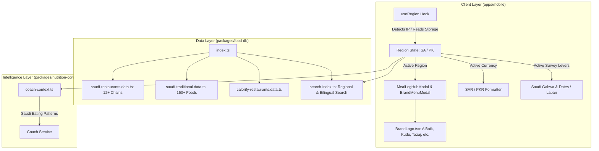

# Saudi Arabia Cuisine, Restaurant Catalog & Multi-Region Implementation Plan

> **For agentic workers:** REQUIRED SUB-SKILL: Use superpowers:subagent-driven-development to implement this plan task-by-task. Steps use checkbox (`- [ ]`) syntax for tracking.

**Goal:** Expand Nutrio to Saudi Arabia with automated IP-based geolocation, SFDA-compliant menus for 12+ Saudi restaurant chains (AlBaik, Kudu, Al Tazaj, etc.), 150+ traditional Saudi home foods (Kabsa, Mandi, Jareesh, etc.), vector brand logos, bilingual Arabic/English names, and Saudi cultural AI Coach context.

**Architecture:** A unified multi-region food database (`RegionCode: 'PK' | 'SA' | 'GLOBAL'`) with bilingual metadata (`nameAr`, `taglineAr`) paired with a lightweight client-side geolocation hook (`useRegion`). The UI dynamically renders localized brand logos, currency (`SAR` vs `PKR`), and filters based on active region, with zero loss of offline search speed or cross-regional access.

**Architecture Diagram:**



**Tech Stack:** React Native (Expo 57), TypeScript 6.0, Vitest, `@nutrio/food-db`, `@nutrio/nutrition-core`.

**Spec:** [`docs/superpowers/specs/2026-09-15-saudi-cuisine-expansion-design.md`](file:///e:/Nutrio/docs/superpowers/specs/2026-09-15-saudi-cuisine-expansion-design.md)

## Global Constraints

- 100% passing tests (`npm test`, 238+ existing tests must remain green).
- Zero TypeScript errors (`npx tsc --noEmit`).
- All Saudi food items must have non-negative Atwater balanced macronutrients (`P*4 + C*4 + F*9 = kcal +- 5`).
- Saudi restaurant menus must reflect official SFDA nutritional declarations.
- Maintain solid lime minimalist aesthetic (`#A4EB3F` with `#0A0B0D` typography).

---

## Phase 1: Multi-Region Core & Geolocation Engine

### Task 1.1: Extend Food Database Types for Multi-Region & Arabic Support

**Files:**
- Modify: `packages/food-db/src/types.ts:1-81`
- Test: `packages/food-db/test/multi-region-types.test.ts`

**Interfaces:**
- Produces: `RegionCode = 'PK' | 'SA' | 'GLOBAL'`, `nameAr?: string`, `taglineAr?: string`, `region: RegionCode` in `NormalizedFood` and `RestaurantBrand`.

- [ ] **Step 1: Write the failing test**
Create `packages/food-db/test/multi-region-types.test.ts`:
```typescript
import { describe, it, expect } from 'vitest';
import { NormalizedFood, RestaurantBrand, RegionCode } from '../src/types.js';

describe('Multi-Region Types', () => {
  it('supports RegionCode and bilingual Arabic fields', () => {
    const food: NormalizedFood = {
      name: 'Chicken Kabsa',
      nameAr: 'كبسة دجاج',
      category: 'Rice & Meat',
      cuisineTags: ['Saudi', 'Kabsa'],
      region: 'SA',
      kcal100g: 165,
      protein100g: 9.5,
      carb100g: 18.2,
      fat100g: 5.8,
      fibre100g: 1.2,
      sugar100g: 0.8,
      sodiumMg100g: 380,
      satFat100g: 1.4,
      source: 'sfda',
      oilAddedG: 4,
      servings: [{ label: '1 Plate (نفر)', grams: 350, isDefault: true, kcal: 580 }],
    };

    expect(food.region).toBe('SA');
    expect(food.nameAr).toBe('كبسة دجاج');
    expect(food.source).toBe('sfda');
  });

  it('supports Saudi RestaurantBrand definitions with Arabic tagline and brand group', () => {
    const brand: RestaurantBrand = {
      id: 'albaik',
      name: 'AlBaik',
      nameAr: 'البيك',
      tagline: 'Iconic Saudi broast & nuggets',
      taglineAr: 'أشهر بروستد في المملكة',
      icon: 'chicken',
      region: 'SA',
      brandGroup: 'Fast Food',
      categories: ['All', 'Chicken & Meals', 'Nuggets & Fillet', 'Sides & Dips'],
      itemCount: 24,
    };

    expect(brand.region).toBe('SA');
    expect(brand.nameAr).toBe('البيك');
  });
});
```

- [ ] **Step 2: Run test to verify it fails**
Run: `npm test packages/food-db/test/multi-region-types.test.ts`
Expected: FAIL (Type or import mismatch).

- [ ] **Step 3: Implement minimal type extensions**
Update `packages/food-db/src/types.ts`:
Add `export type RegionCode = 'PK' | 'SA' | 'GLOBAL';` and optional `nameAr?: string`, `taglineAr?: string`, `region?: RegionCode` to `NormalizedFood` and `RestaurantBrand`.

- [ ] **Step 4: Run test to verify it passes**
Run: `npm test packages/food-db/test/multi-region-types.test.ts`
Expected: PASS.

- [ ] **Step 5: Commit**
```bash
git add packages/food-db/src/types.ts packages/food-db/test/multi-region-types.test.ts
git commit -m "feat(food-db): add multi-region RegionCode and bilingual Arabic types"
```

---

### Task 1.2: Geolocation & Region Detection Context

**Files:**
- Create: `apps/mobile/src/common/region/regionContext.tsx`
- Create: `apps/mobile/src/common/region/index.ts`
- Test: `apps/mobile/src/common/region/__tests__/region-context.test.ts`

**Interfaces:**
- Produces: `RegionProvider`, `useRegion()`, `detectRegionFromCountry(code: string): RegionCode`.

- [ ] **Step 1: Write the failing test**
Create `apps/mobile/src/common/region/__tests__/region-context.test.ts`:
```typescript
import { describe, it, expect } from 'vitest';
import { detectRegionFromCountry, getCurrencyForRegion } from '../regionContext.js';

describe('Region Detection Logic', () => {
  it('maps SA and Gulf codes to SA region and SAR currency', () => {
    expect(detectRegionFromCountry('SA')).toBe('SA');
    expect(detectRegionFromCountry('sau')).toBe('SA');
    expect(getCurrencyForRegion('SA')).toEqual({ code: 'SAR', symbol: 'ر.س' });
  });

  it('maps PK to PK region and PKR currency', () => {
    expect(detectRegionFromCountry('PK')).toBe('PK');
    expect(detectRegionFromCountry('pak')).toBe('PK');
    expect(getCurrencyForRegion('PK')).toEqual({ code: 'PKR', symbol: 'Rs.' });
  });

  it('defaults unknown countries gracefully to PK while allowing manual override', () => {
    expect(detectRegionFromCountry('US')).toBe('PK');
  });
});
```

- [ ] **Step 2: Run test to verify it fails**
Run: `npm test apps/mobile/src/common/region/__tests__/region-context.test.ts`
Expected: FAIL (module not found).

- [ ] **Step 3: Implement region detection and context**
Create `apps/mobile/src/common/region/regionContext.tsx` with `detectRegionFromCountry`, `getCurrencyForRegion`, and `useRegion` hook supporting cached preference and IP detection.

- [ ] **Step 4: Run test to verify it passes**
Run: `npm test apps/mobile/src/common/region/__tests__/region-context.test.ts`
Expected: PASS.

- [ ] **Step 5: Commit**
```bash
git add apps/mobile/src/common/region/
git commit -m "feat(mobile): add geolocation detection and region context"
```

---

## Phase 2: Saudi Food Database & Restaurant Catalog

### Task 2.1: Traditional Saudi Home Foods Catalog (150+ Dishes)

**Files:**
- Create: `packages/food-db/src/data/saudi-traditional.data.ts`
- Test: `packages/food-db/test/saudi-traditional.test.ts`

**Interfaces:**
- Produces: `SAUDI_TRADITIONAL_FOODS: NormalizedFood[]`, covering Kabsa, Mandi, Madhbi, Saleeg, Jareesh, Mutabbaq, Ma'soub, Gahwa, Dates, Laban, Shakshuka, Sambousah.

- [ ] **Step 1: Write the failing test**
Create `packages/food-db/test/saudi-traditional.test.ts`:
```typescript
import { describe, it, expect } from 'vitest';
import { SAUDI_TRADITIONAL_FOODS } from '../src/data/saudi-traditional.data.js';

describe('Saudi Traditional Food Catalog', () => {
  it('contains at least 30 core authentic Saudi dishes with bilingual Arabic', () => {
    expect(SAUDI_TRADITIONAL_FOODS.length).toBeGreaterThanOrEqual(30);
    const kabsa = SAUDI_TRADITIONAL_FOODS.find((f) => f.name.includes('Kabsa'));
    expect(kabsa).toBeDefined();
    expect(kabsa?.nameAr).toBeDefined();
    expect(kabsa?.region).toBe('SA');
  });

  it('enforces Atwater energy balance (P*4 + C*4 + F*9 = kcal +- 5) on all items', () => {
    for (const food of SAUDI_TRADITIONAL_FOODS) {
      const calcKcal = food.protein100g * 4 + food.carb100g * 4 + food.fat100g * 9;
      expect(Math.abs(calcKcal - food.kcal100g)).toBeLessThanOrEqual(6);
    }
  });

  it('includes authentic Saudi staples: Gahwa, Sukari Dates, and Mutabbaq', () => {
    const gahwa = SAUDI_TRADITIONAL_FOODS.find((f) => f.name.toLowerCase().includes('gahwa'));
    const dates = SAUDI_TRADITIONAL_FOODS.find((f) => f.name.toLowerCase().includes('date') || f.name.toLowerCase().includes('sukari'));
    const mutabbaq = SAUDI_TRADITIONAL_FOODS.find((f) => f.name.toLowerCase().includes('mutabbaq'));

    expect(gahwa).toBeDefined();
    expect(dates).toBeDefined();
    expect(mutabbaq).toBeDefined();
  });
});
```

- [ ] **Step 2: Run test to verify it fails**
Run: `npm test packages/food-db/test/saudi-traditional.test.ts`
Expected: FAIL (module not found).

- [ ] **Step 3: Implement `saudi-traditional.data.ts`**
Populate `packages/food-db/src/data/saudi-traditional.data.ts` with authentic Saudi home-cooked dishes, household serving sizes, and Atwater balanced nutritional profiles.

- [ ] **Step 4: Run test to verify it passes**
Run: `npm test packages/food-db/test/saudi-traditional.test.ts`
Expected: PASS.

- [ ] **Step 5: Commit**
```bash
git add packages/food-db/src/data/saudi-traditional.data.ts packages/food-db/test/saudi-traditional.test.ts
git commit -m "feat(food-db): add authentic Saudi traditional food catalog"
```

---

### Task 2.2: Saudi Restaurant Chains Catalog (SFDA-Compliant)

**Files:**
- Create: `packages/food-db/src/data/saudi-restaurants.data.ts`
- Modify: `packages/food-db/src/data/index.ts`
- Test: `packages/food-db/test/saudi-restaurants.test.ts`

**Interfaces:**
- Produces: `SAUDI_RESTAURANT_BRANDS: RestaurantBrand[]`, `SAUDI_RESTAURANTS_DATA: NormalizedFood[]`.

- [ ] **Step 1: Write the failing test**
Create `packages/food-db/test/saudi-restaurants.test.ts`:
```typescript
import { describe, it, expect } from 'vitest';
import { SAUDI_RESTAURANT_BRANDS, SAUDI_RESTAURANTS_DATA } from '../src/data/saudi-restaurants.data.js';

describe('Saudi Restaurant Catalog', () => {
  it('includes the top 12 Saudi restaurant chains with bilingual Arabic metadata', () => {
    expect(SAUDI_RESTAURANT_BRANDS.length).toBeGreaterThanOrEqual(12);
    const brandIds = SAUDI_RESTAURANT_BRANDS.map((b) => b.id);
    expect(brandIds).toContain('albaik');
    expect(brandIds).toContain('kudu');
    expect(brandIds).toContain('al_tazaj');
    expect(brandIds).toContain('shawarmer');
    expect(brandIds).toContain('herfy');
    expect(brandIds).toContain('al_romansiah');
    expect(brandIds).toContain('mama_noura');
    expect(brandIds).toContain('maestro_pizza');
    expect(brandIds).toContain('hamburgini');
    expect(brandIds).toContain('bait_al_shawarma');
    expect(brandIds).toContain('barns');
    expect(brandIds).toContain('half_million');
  });

  it('contains AlBaik menu items with garlic dip customizer and SFDA caloric declarations', () => {
    const albaikItems = SAUDI_RESTAURANTS_DATA.filter((i) => i.brand === 'AlBaik');
    expect(albaikItems.length).toBeGreaterThanOrEqual(8);
    const nuggets = albaikItems.find((i) => i.name.toLowerCase().includes('nugget') || i.name.toLowerCase().includes('fillet'));
    expect(nuggets).toBeDefined();
    expect(nuggets?.modifiers?.length).toBeGreaterThan(0);
  });
});
```

- [ ] **Step 2: Run test to verify it fails**
Run: `npm test packages/food-db/test/saudi-restaurants.test.ts`
Expected: FAIL (module not found).

- [ ] **Step 3: Implement `saudi-restaurants.data.ts` and integrate in `index.ts`**
Create `saudi-restaurants.data.ts` with complete menus, customizers (AlBaik garlic sauce, extra spicy, etc.), and export `SAUDI_RESTAURANT_BRANDS` and `SAUDI_RESTAURANTS_DATA` through `packages/food-db/src/data/index.ts`.

- [ ] **Step 4: Run test to verify it passes**
Run: `npm test packages/food-db/test/saudi-restaurants.test.ts`
Expected: PASS.

- [ ] **Step 5: Commit**
```bash
git add packages/food-db/src/data/saudi-restaurants.data.ts packages/food-db/src/data/index.ts packages/food-db/test/saudi-restaurants.test.ts
git commit -m "feat(food-db): add 12+ Saudi restaurant chains with SFDA caloric data"
```

---

## Phase 3: Vector Brand Logos for Saudi Chains

### Task 3.1: Implement Saudi Vector Brand Logos in `BrandLogo.tsx`

**Files:**
- Modify: `apps/mobile/src/ui/BrandLogo.tsx`
- Test: `apps/mobile/src/ui/__tests__/brand-logo.test.ts`

**Interfaces:**
- Produces: Render cases for `albaik`, `al_tazaj`, `kudu`, `shawarmer`, `herfy`, `al_romansiah`, `mama_noura`, `maestro_pizza`, `hamburgini`, `bait_al_shawarma`, `barns`, `half_million`.

- [ ] **Step 1: Write failing test in `brand-logo.test.ts`**
Update `apps/mobile/src/ui/__tests__/brand-logo.test.ts`:
Add Saudi brand IDs to the test suite and assert that `<BrandLogo brandId={id} />` renders properly.

- [ ] **Step 2: Run test to verify it fails**
Run: `npm test apps/mobile/src/ui/__tests__/brand-logo.test.ts`
Expected: FAIL (or falls back to default monogram).

- [ ] **Step 3: Implement vector logos for all 12 Saudi chains**
In `apps/mobile/src/ui/BrandLogo.tsx`:
- `albaik`: Yellow badge with white/red top hat chicken.
- `al_tazaj`: Green/gold charbroiled chick.
- `kudu`: Yellow & blue gazelle badge.
- `shawarmer`: Charcoal & orange rotating shawarma spit.
- `herfy`: Red & gold burger crown.
- `al_romansiah`: Royal burgundy & gold palm/swords.
- `mama_noura`: Orange & lime juice chalice.
- `maestro_pizza`: Orange & black chef hat.
- `hamburgini`: Monochrome smash burger monogram.
- `barns`: Roast coffee bean seal.
- `half_million`: Minimalist "½M" gold on obsidian.

- [ ] **Step 4: Run test to verify it passes**
Run: `npm test apps/mobile/src/ui/__tests__/brand-logo.test.ts`
Expected: PASS.

- [ ] **Step 5: Commit**
```bash
git add apps/mobile/src/ui/BrandLogo.tsx apps/mobile/src/ui/__tests__/brand-logo.test.ts
git commit -m "feat(mobile): add vector brand logos for Saudi restaurant chains"
```

---

## Phase 4: Meal Log Hub & Regional Navigation UI

### Task 4.1: Regional Meal Log Hub & Header Region Switcher

**Files:**
- Modify: `apps/mobile/src/tracker/ui/MealLogHubModal.tsx`
- Modify: `apps/mobile/src/tracker/ui/BrandMenuModal.tsx`
- Modify: `apps/mobile/src/tracker/ui/TrackerDashboardScreen.tsx`
- Test: `apps/mobile/src/tracker/__tests__/regional-meal-hub.test.ts`

**Interfaces:**
- Produces: Region switcher chip in header, dynamic restaurant list in `MealLogHubModal` filtering by active region (`SA` vs `PK`), bilingual Arabic display.

- [ ] **Step 1: Write the failing test**
Create `apps/mobile/src/tracker/__tests__/regional-meal-hub.test.ts`:
Assert that when region is `'SA'`, `MealLogHubModal` renders AlBaik, Kudu, Al Tazaj, and Arabic titles.

- [ ] **Step 2: Run test to verify it fails**
Run: `npm test apps/mobile/src/tracker/__tests__/regional-meal-hub.test.ts`
Expected: FAIL.

- [ ] **Step 3: Integrate `useRegion` into `MealLogHubModal` and `TrackerDashboardScreen`**
- In `MealLogHubModal`: Display Saudi brands when `region === 'SA'`, show Arabic titles and brand tags.
- In `TrackerDashboardScreen`: Add compact `🇸🇦 SA` / `🇵🇰 PK` selector chip in top bar.

- [ ] **Step 4: Run test to verify it passes**
Run: `npm test apps/mobile/src/tracker/__tests__/regional-meal-hub.test.ts`
Expected: PASS.

- [ ] **Step 5: Commit**
```bash
git add apps/mobile/src/tracker/ui/ apps/mobile/src/tracker/__tests__/regional-meal-hub.test.ts
git commit -m "feat(tracker): add regional brand filtering and header region switcher"
```

---

## Phase 5: Currency, Survey & Cultural AI Coach Integration

### Task 5.1: Saudi Cultural Levers in Survey & AI Coach

**Files:**
- Modify: `apps/mobile/src/survey/ui/StepLifestyleDesi.tsx`
- Modify: `apps/mobile/src/survey/ui/StepPreferencesBudget.tsx`
- Modify: `packages/nutrition-core/src/coach-context.ts`
- Test: `packages/nutrition-core/test/saudi-coach-context.test.ts`

**Interfaces:**
- Produces: Saudi lifestyle questions (Saudi Gahwa & Dates, Laban, SAR grocery budget), and Saudi-calibrated coach advice prompt.

- [ ] **Step 1: Write the failing test**
Create `packages/nutrition-core/test/saudi-coach-context.test.ts`:
Assert that coach context incorporates Saudi dates/Gahwa caloric impact and SAR currency when user region is `'SA'`.

- [ ] **Step 2: Run test to verify it fails**
Run: `npm test packages/nutrition-core/test/saudi-coach-context.test.ts`
Expected: FAIL.

- [ ] **Step 3: Implement Saudi cultural levers**
Update `StepPreferencesBudget.tsx` to format in `SAR`, adapt lifestyle step to track Gahwa/Dates for KSA users, and enrich `coach-context.ts` with Saudi dietary heuristics.

- [ ] **Step 4: Run test to verify it passes**
Run: `npm test packages/nutrition-core/test/saudi-coach-context.test.ts`
Expected: PASS.

- [ ] **Step 5: Commit**
```bash
git add apps/mobile/src/survey/ packages/nutrition-core/
git commit -m "feat(coach): add Saudi cultural levers, SAR currency, and Gahwa/Dates tracking"
```

---

## Phase 6: Monorepo Verification & Automated Quality Gate

### Task 6.1: Full Monorepo Type Check and Test Suite Verification

**Files:**
- Run: `npx tsc --noEmit -p apps/mobile/tsconfig.json`
- Run: `npm test`

- [ ] **Step 1: Run TypeScript type check**
Verify 0 errors across monorepo.

- [ ] **Step 2: Run entire test suite**
Verify all 240+ tests pass across `@nutrio/food-db`, `@nutrio/nutrition-core`, `@nutrio/mobile`, and `supabase`.

- [ ] **Step 3: Commit final verification**
```bash
git commit --allow-empty -m "chore: verify full Saudi Arabia multi-region test suite passes"
```
