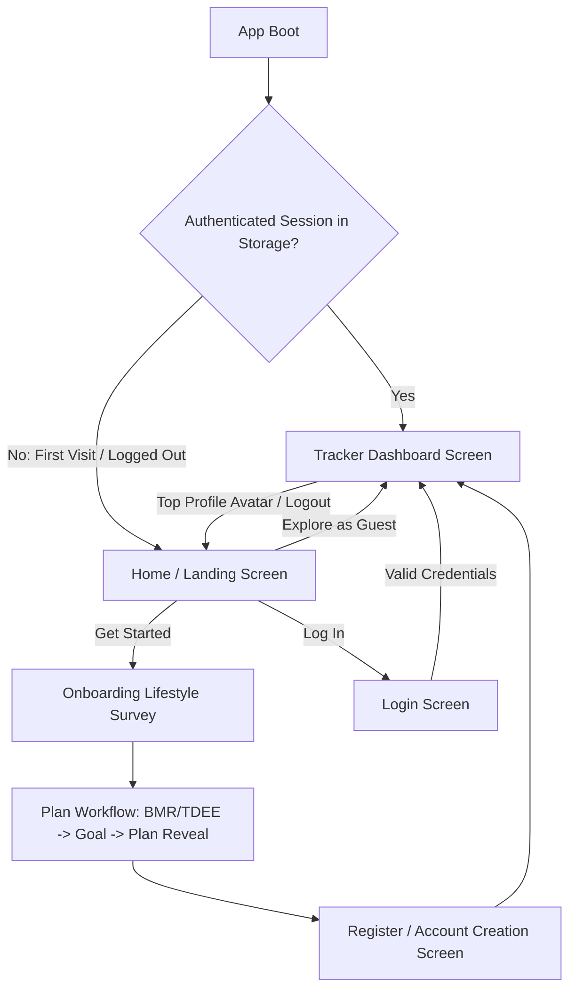

# Home Screen, Authentication Flow & Universal Navigation Spec

**Date:** 2026-09-04  
**Status:** Approved  
**Topic:** Home/Landing Screen, Login & Register Authentication, Session Management, Back Navigation, and Screen Architecture

---

## 1. Goal
Provide a production-grade entry experience for Nutrio:
1. **Unregistered / First-Time Users** land on an engaging **Home Screen** (Hero value proposition, Pakistani culinary features, AI photo scanner demo).
2. Tapping **"Get Started"** launches the **Onboarding Survey**, followed by the **Plan Workflow**, leading seamlessly into account creation and the **Tracker Dashboard**.
3. **Existing Registered Users** can tap **"Log In"** to authenticate, with their session remembered in local storage so subsequent visits boot directly to the **Tracker Dashboard**.
4. Implement a universal **Back Button & Header Navigation** system across all screens, including a **Profile / Account Drawer** on the Dashboard with a **"Log Out / Go to Home Screen"** action, ensuring users are never trapped.

---

## 2. Global Constraints & Principles
- **Preserve 100% Existing Logic:** All 146 existing tests across `@nutrio/food-db`, `@nutrio/nutrition-core`, `@nutrio/mobile`, and Supabase functions must pass with zero regression.
- **Design System:** Strictly follow the Light Emerald Theme (`#F6F8F6` canvas, `#FFFFFF` cards, `#10B981` primary emerald, `#1E293B` text) with **Plus Jakarta Sans** typography and vector SVG icons (`apps/mobile/src/ui/Icon.tsx`). No raw emojis as icons.
- **Offline & Local-First Auth:** Session state stored cleanly via `authStorage.ts` (persisting current user, registration status, and active plan in `localStorage` / memory).

---

## 3. User Journey & State Machine

---

## 4. Screen Architecture & Responsibilities

### Screen 1: `HomeScreen.tsx` (Landing / Welcome Screen)
- **Hero Section:**
  - Headline: *"Your AI Desi Nutritionist in Your Pocket"*
  - Subtitle: *"Precision calorie tracking for Biryani, Karahi, and Roti. Multimodal AI photo analysis with zero hallucination."*
- **Interactive Feature Highlights:**
  - 📸 **AI Meal Photo Scanner:** Preview card showing 1-tap portion detection & exact grams.
  - 🍲 **527 Authentic Pakistani Dishes:** Calibrated handi cooking oil & doodh patti chai accounting.
  - 🧑‍⚕️ **Context-Aware AI Coach:** Personalized clinical & cultural guidance.
  - ⚖️ **Adaptive TDEE Engine:** Dynamic weekly metabolic adjustments.
- **Action CTAs:**
  - `[⚡ Get Started (Free Assessment)]` -> Navigates to Survey -> Plan -> Register -> Tracker.
  - `[🔑 Log In to Existing Account]` -> Navigates to AuthScreen (Login mode).
  - `[👀 Explore as Guest / Demo]` -> Sets guest session and opens Tracker Dashboard directly.

### Screen 2: `AuthScreen.tsx` (Login & Registration Screen)
- **Segmented Tabs:** `[Sign In]` and `[Create Account]`
- **Form Controls:**
  - Email address input with format validation.
  - Password input (minimum 6 characters) with show/hide toggle.
  - Full Name input (in Register mode, defaults to "Talha").
  - "Remember Me" checkbox toggle.
- **Submission:**
  - Sign In: validates credentials, saves user session to `authStorage`, transitions to Tracker Dashboard.
  - Create Account: creates profile, links existing or default plan, transitions to Tracker Dashboard.
  - "Back to Home" top-left button.

### Screen 3: Universal Back Buttons & Profile Header
- **`TrackerDashboardScreen.tsx`:**
  - User avatar in header: tapping opens **Profile & Session Modal**:
    - Displays user name (`Talha`), email, target calories, BMR, and current weight.
    - Action buttons: `[⚙️ Retake Survey]`, `[📋 View Plan]`, and `[🚪 Log Out / Return to Home Screen]`.
- **Sub-Screens (`WeeklyPlanView.tsx`, `WeightTrackerScreen.tsx`, `CoachChatScreen.tsx`, `OnboardingSurveyScreen.tsx`, `PlanWorkflowScreen.tsx`):**
  - Uniform `<Icon name="arrow-left" /> Back` top pill button returning to either the Tracker Dashboard or Home Screen.

---

## 5. Storage Layer (`apps/mobile/src/auth/authStorage.ts`)
- `getAuthSession(): AuthSession | null`
- `saveAuthSession(session: AuthSession): void`
- `clearAuthSession(): void`
- `isUserRegistered(): boolean`

---

## 6. Testing & Verification
- Unit test suite for `authStorage.ts`: login, register, session persistence, logout.
- Component test for `HomeScreen.tsx` (renders CTAs, triggers callbacks).
- Component test for `AuthScreen.tsx` (validates inputs, toggles between login and register).
- Full monorepo `npm test` verifying all 146 existing tests pass alongside new tests.
